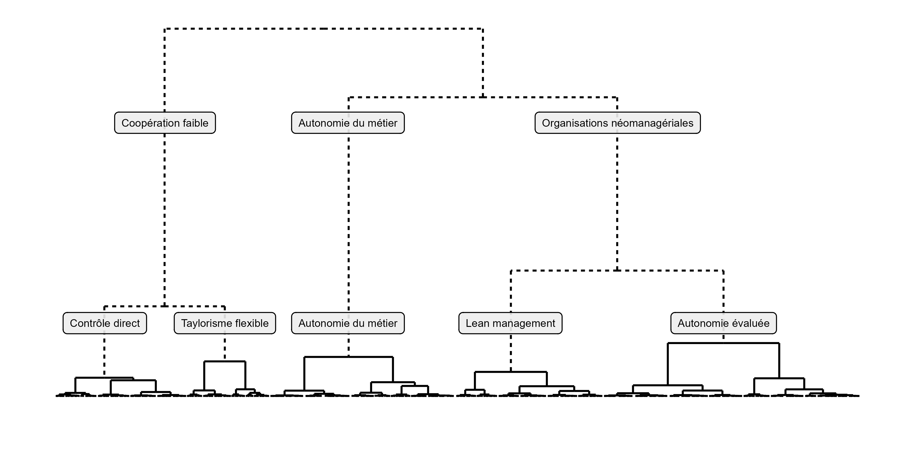

<!--   rmdformats::downcute: -->

<!-- html_document: -->
<!-- highlight: tango -->

<!-- Liens html : pas d'accents etc dans les titres de niveau 2 -->

```{r setup, include=FALSE}
knitr::opts_chunk$set(
  echo = TRUE, warning = FALSE, message = FALSE
)

source("~\\github/socio_public_services/2024_OrgaTravailAdminPub/Demarrage.R", encoding = "UTF-8")
# options("tabxplor.output_kable" = TRUE) # options("tabxplor.kable_popover" = TRUE)
# options(tabxplor.color_style_theme = "dark")

ct <- readRDS("~\\Data\\Conditions de travail\\ct.rds")

# Ajouter classification ascendante hiérarchique (CAH) sauvegardée : variable cah_orga
ct <- ct |> left_join(readRDS("~\\github/socio_public_services/2024_OrgaTravailAdminPub\\cah_orga_final.rds"), by = "ID") 

# Variables logiques pour délimiter le champ
salariat05 <- ct$CHAMP_CT2005 == "1-Champ 2005" & ct$ANNEE %in% c("2005", "2013", "2019") & 
  !ct$EMP %in% c("8-Particuliers", "I-Pas d'employeur", "I-Pas d’employeur") & !is.na(ct$EMP) &
  !is.na(ct$pondcal)

`2005` <- ct$ANNEE == "2005"
`2013` <- ct$ANNEE == "2013"
`2016` <- ct$ANNEE == "2016"
`2019` <- ct$ANNEE == "2019"

# Champs et sources
champ05  <- "Champ : salarié·es des organisations, France métropolitaine. Pourcentages pondérés."

source0519 <- "Source : Dares-Drees-DGAFP, enquête Conditions de travail 2005, 2013 et 2019, volet actifs occupés (diffusion Adisp)."

source19 <- "Source : Dares-Drees-DGAFP, enquête Conditions de travail 2019, volet actifs occupés (diffusion Adisp)."


# Derniers ajustements des noms de catégories
ct <- ct |> mutate(SEXE = fct_rev(SEXE) )
ct <- ct |> mutate(PPP1 = fct_relevel(PPP1, "1-Chefs d’entreprise", "2-Cadres", "4-Professions organisées") )

ct <- ct |> mutate(
  EMP5_ETAT_GES = fct_recode(EMP5_ETAT_GES,
                             "11-État/HP" = "11-État_HP"                        ,
                             "12-GES"     = "12-Grandes entreprises de services" )
)

ct <- ct |> 
  mutate(EMP4 = fct_relevel(EMP4, "11-État", "12-Grandes entreprises de services", "30-Grande industrie"))

ct <- ct|> mutate(NOUVELLE =  fct_recode(
  NOUVELLE,
  "1-Apprendre des choses"                  = "1-Apprendre des choses",
  "2-Ne pas apprendre des choses nouvelles" = "2-Pas apprendre"
))


ct <- ct |> mutate(COMMENT = fct_relevel(COMMENT, sort))


```

```{css, echo=FALSE}
/* Reduce line spacing in kable() tables */
.page-content table tbody tr td,
.page-content table thead tr th {
padding: 0px 3px; /* 1) line spacing ; 2) line indentation*/
border-bottom: 1px solid var(--border-color);
border-top: none;
text-align: left
}

/* 
.page-content table thead tr th {
color: var(--table-header-color);
background: var(--table-header-background);
border-bottom: 1px solid var(--border-color);
border-top: 1px solid var(--border-color) !important;
font-weight: 400;
font-size: 14px;
padding: 0px 
}
*/
/* padding: 0px : line spacing in headers */

/*
.page-content .table-wrapper {
overflow-x: auto;
margin-bottom: 3rem;
}

.page-content table {
width: 100%;
border-spacing: 0;
border-collapse: separate
}


.page-content table thead tr th:first-child {
border-left: 1px solid var(--border-color);
border-radius: 4px 0 0 4px
}

.page-content table thead tr th:last-child {
border-right: 1px solid var(--border-color);
border-radius: 0 4px 4px 0
}


```


Le code ci-dessous permet de reproduire les analyses, les tableaux et les graphiques de l'article scientifique suivant (pour qui dispose déjà des données, soumises au secret statistique, des enquêtes Conditions de travail) : 

**Brice Nocenti, « Les formes d’organisation du travail dans les administrations publiques : quelle managérialisation de l’État, des hôpitaux et des collectivités locales ? », _Travail et emploi_, n° 168/2022.** 

**AJOUTER LIEN PERENNE VERS L'ARTICLE FINAL.**

Sont également inclus des tableaux décrivant les taux de féminisation des différentes professions, utilisés pour féminiser leurs noms dans l'article.

Source : Dares-Drees-DGAFP, Enquêtes Conditions de travail 2005, 2013, 2016 et 2019, diffusion Adisp. 

[Revenir à la liste des articles.](https://bricenocenti.github.io/socio_public_services/)

<br>


## **Reproduire les analyses : marche a suivre**

**1. Commander les données auprès de l'ADISP sur le site Quetelet-Progedo: **

https://data.progedo.fr/studies/doi/10.13144/lil-1459 

https://commande.progedo.fr 

<br>

**2. Créer un Projet R et installer les packages nécessaires**

Créer un nouveau projet RStudio (File > New Project), dans un nouveau dossier. Pour initialer le projett sans packages installés et utiliser les versions données ci-dessous, cocher la case "Use renv with this project". 

Au sein du dossier du projet, copier tous les fichiers du répertoire  [https://github.com/BriceNocenti/socio_public_services/blob/main/2024_OrgaTravailAdminPub](https://github.com/BriceNocenti/socio_public_services/blob/main/2024_OrgaTravailAdminPub). 

Les analyses ont été réalisées sur `R 4.3.2` (Windows 10). 

Voici une liste des packages utilisés et de leurs versions, à par exemple installer avec le package `renv::` :

``` {r eval = FALSE, echo = TRUE, class.source = 'fold-hide'}
# utils::install.packages("renv")
renv::install(c(
  "DBI@1.2.1"                  ,
  "DT@0.31"                    ,
  "DescTools@0.99.54"          ,
  "Exact@3.2"                 ,
  "FactoMineR@2.9"            ,
  "MASS@7.3-60.0.1"           ,
  "Matrix@1.6-5"              ,
  "MatrixModels@0.5-3"        ,
  "R6@2.5.1"                  ,
  "RColorBrewer@1.1-3"        ,
  "Rcpp@1.0.12"               ,
  "RcppEigen@0.3.3.9.4"       ,
  "SparseM@1.81"              ,
  "abind@1.4-5"               ,
  "askpass@1.2.0"             ,
  "backports@1.4.1"           ,
  "base64enc@0.1-3"           ,
  "boot@1.3-28.1"             ,
  "brio@1.1.4"                ,
  "broom@1.0.5"               ,
  "bslib@0.6.1"               ,
  "cachem@1.0.8"              ,
  "callr@3.7.3"               ,
  "car@3.1-2"                 ,
  "carData@3.0-5"             ,
  "cellranger@1.1.0"          ,
  "class@7.3-22"              ,
  "cli@3.6.2"                 ,
  "cluster@2.1.6"             ,
  "colorspace@2.1-0"          ,
  "cpp11@0.4.7"               ,
  "crayon@1.5.2"              ,
  "crosstalk@1.2.1"           ,
  "curl@5.2.0"                ,
  "data.table@1.15.0"         ,
  "desc@1.4.3"                ,
  "diffobj@0.3.5"             ,
  "digest@0.6.34"             ,
  "dplyr@1.1.4"               ,
  "e1071@1.7-14"              ,
  "ellipse@0.5.0"             ,
  "ellipsis@0.3.2"            ,
  "emmeans@1.10.0"            ,
  "estimability@1.4.1"        ,
  "evaluate@0.23"             ,
  "expm@0.999-9"              ,
  "fansi@1.0.6"               ,
  "farver@2.1.1"              ,
  "fastmap@1.1.1"             ,
  "flashClust@1.01-2"         ,
  "fontawesome@0.5.2"         ,
  "forcats@1.0.0"             ,
  "fs@1.6.3"                  ,
  "generics@0.1.3"            ,
  "ggfacto@0.2.3"             ,
  "ggiraph@0.8.8"             ,
  "ggplot2@3.4.4"             ,
  "ggrepel@0.9.5"             ,
  "gld@2.6.6"                 ,
  "glue@1.7.0"                ,
  "gridExtra@2.3"             ,
  "gtable@0.3.4"              ,
  "highr@0.10"                ,
  "hms@1.1.3"                 ,
  "htmltools@0.5.7"           ,
  "htmlwidgets@1.6.4"         ,
  "httpuv@1.6.14"             ,
  "httr@1.4.7"                ,
  "isoband@0.2.7"             ,
  "jquerylib@0.1.4"           ,
  "jsonlite@1.8.8"            ,
  "kableExtra@1.4.0"          ,
  "knitr@1.45"                ,
  "labeling@0.4.3"            ,
  "later@1.3.2"               ,
  "lattice@0.22-5"            ,
  "lazyeval@0.2.2"            ,
  "leaps@3.1"                 ,
  "lifecycle@1.0.4"           ,
  "lme4@1.1-35.1"             ,
  "lmom@3.0"                  ,
  "magrittr@2.0.3"            ,
  "memoise@2.0.1"             ,
  "mgcv@1.9-1"                ,
  "mime@0.12"                 ,
  "minqa@1.2.6"               ,
  "multcompView@0.1-9"        ,
  "munsell@0.5.0"             ,
  "mvtnorm@1.2-4"             ,
  "nlme@3.1-164"              ,
  "nloptr@2.0.3"              ,
  "nnet@7.3-19"               ,
  "numDeriv@2016.8-1.1"       ,
  "openssl@2.1.1"             ,
  "pbkrtest@0.5.2"            ,
  "pillar@1.9.0"              ,
  "pkgbuild@1.4.3"            ,
  "pkgconfig@2.0.3"           ,
  "pkgload@1.3.4"             ,
  "praise@1.0.0"              ,
  "prettyunits@1.2.0"         ,
  "processx@3.8.3"            ,
  "progress@1.2.3"            ,
  "promises@1.2.1"            ,
  "proxy@0.4-27"              ,
  "ps@1.7.6"                  ,
  "purrr@1.0.2"               ,
  "quantreg@5.97"             ,
  "rappdirs@0.3.3"            ,
  "readxl@1.4.3"              ,
  "rematch2@2.1.2"            ,
  "rematch@2.0.0"             ,
  "renv@1.0.3"                ,
  "rlang@1.1.3"               ,
  "rmarkdown@2.25"            ,
  "rootSolve@1.8.2.4"         ,
  "rprojroot@2.0.4"           ,
  "rstudioapi@0.15.0"         ,
  "sass@0.4.8"                ,
  "scales@1.3.0"              ,
  "scatterplot3d@0.3-44"      ,
  "stringi@1.8.3"             ,
  "stringr@1.5.1"             ,
  "survival@3.5-7"            ,
  "svglite@2.1.3"             ,
  "sys@3.4.2"                 ,
  "systemfonts@1.0.5"         ,
  "BriceNocenti/tabxplor@HEAD",
  #"tabxplor@1.1.3"           ,
  "testthat@3.2.1"            ,
  "tibble@3.2.1"              ,
  "tidyr@1.3.1"               ,
  "tidyselect@1.2.0"          ,
  "tinytex@0.49"              ,
  "utf8@1.2.4"                ,
  "uuid@1.2-0"                ,
  "vctrs@0.6.5"               ,
  "viridisLite@0.4.2"         ,
  "waldo@0.5.2"               ,
  "widgetframe@0.3.1"         ,
  "withr@3.0.0"               ,
  "xfun@0.42"                 ,
  "xml2@1.3.6"                ,
  "yaml@2.3.8"                ,
  "BriceNocenti/pcspp@HEAD"   ,
  "Formula@1.2-5"             ,
  "Hmisc@5.1-1"               ,
  "bit64@4.0.5"               ,
  "bit@4.0.5"                 ,
  "checkmate@2.3.1"           ,
  "clipr@0.8.0"               ,
  "dineq@0.1.0"               ,
  "foreign@0.8-86"            ,
  "htmlTable@2.4.2"           ,
  "readr@2.1.5"               ,
  "rpart@4.1.23"              ,
  "tzdb@0.4.0"                ,
  "viridis@0.6.5"             ,
  "vroom@1.6.5"               ,
  "RcppArmadillo@0.12.8.0.0"  ,
  "RcppGSL@0.3.13"            ,
  "RcppParallel@5.1.7"        ,
  "RcppZiggurat@0.1.6"        ,
  "Rfast@2.1.0"               ,
  "TraMineR@2.2-9"            ,
  "blob@1.2.4"                ,
  "conflicted@1.2.0"          ,
  "dbplyr@2.4.0"              ,
  "dtplyr@1.3.1"              ,
  "gargle@1.5.2"              ,
  "googledrive@2.1.1"         ,
  "googlesheets4@1.1.1"       ,
  "haven@2.5.4"               ,
  "ids@1.0.1"                 ,
  "lubridate@1.9.3"           ,
  "modelr@0.1.11"             ,
  "permute@0.9-7"             ,
  "ragg@1.2.7"                ,
  "reprex@2.1.0"              ,
  "rvest@1.0.4"               ,
  "selectr@0.4-2"             ,
  "seqhandbook@0.1.1"         ,
  "textshaping@0.3.7"         ,
  "tidyverse@2.0.0"           ,
  "timechange@0.3.0"          ,
  "vegan@2.6-4"               #,
))
```

``` {r eval = FALSE, echo = FALSE}
# # To find packages uses in scripts
# renv::embed("D:/Statistiques/github/socio_public_services/2024_OrgaTravailAdminPub/Les formes d'organisation du travail dans les administrations publiques.Rmd")
# renv::embed("D:/Statistiques/github/socio_public_services/2024_OrgaTravailAdminPub/Demarrage.R")
# renv::embed("D:/Statistiques/github/socio_public_services/2024_OrgaTravailAdminPub/ctall_mf.R")
# # mettre les renv::use() ajoutés au début des fichiers dans des vecteurs, puis : 
# unique( c(base_rmd, ctall_mf, demarrage ) ) 
# 
# # renv::dependencies(path = "2024_OrgaTravailAdminPub") |> as_tibble()

```


**3. Entrer le chemin d'accès des bases de données des quatre enquêtes**
``` {r intro3, eval = FALSE, echo = TRUE, class.source = 'fold-show'}
ct_paths <- c(
  "2005" = "~\\Data\\Conditions de travail\\CT2005\\ct05diffusion.sav",
  "2013" = "~\\Data\\Conditions de travail\\CT2013_IND\\SAS\\individus_ct2013.sas7bdat",
  "2016" = "~\\Data\\Conditions de travail\\CT2016_IND\\SAS\\individus_ao_rps2016_quetelet.sas7bdat",
  "2019" = "~\\Data\\Conditions de travail\\CT2019_IND\\SAS\\individus_ao_ct2019_adisp.sas7bdat"
)
```

<br>

**4. Sourcer le script de mise en forme des bases de données**
``` {r intro4, eval = FALSE, echo = TRUE, class.source = 'fold-show'}
# setwd() # si ce n'est pas le cas, préciser le dossier du projet comme working directory

source("Demarrage.R", encoding = "UTF-8") # charger les fonctions nécessaires
source("ctall_mf.R", encoding = "UTF-8")
```

<br>

**5. Enregister le résultat dans le dossier actuel**
``` {r intro5, eval = FALSE, echo = TRUE, class.source = 'fold-show'}
saveRDS(ct, file = "ct.rds", compress = FALSE)
```

<br>

**6. Appliquer le code des analyses, ci-dessous**

<br>

<br>

## **Analyses**

### **Demarrage**
```{r startup, eval = FALSE, echo = TRUE, class.source = 'fold-show'}
library(tidyverse)
library(rlang)
library(tabxplor)
library(FactoMineR)
library(ggfacto)

source("Demarrage.R", encoding = "UTF-8")
ct <- readRDS("ct.rds")

# Variables logiques pour délimiter le champ
salariat05 <- ct$CHAMP_CT2005 == "1-Champ 2005" & 
  ct$ANNEE %in% c("2005", "2013", "2019") & 
  !ct$EMP %in% c("8-Particuliers", "I-Pas d'employeur", "I-Pas d’employeur") &
  !is.na(ct$EMP) & !is.na(ct$pondcal)

`2005` <- ct$ANNEE == "2005"
`2013` <- ct$ANNEE == "2013"
`2016` <- ct$ANNEE == "2016"
`2019` <- ct$ANNEE == "2019"

# Champs et sources
champ05 <- "Champ : salarié·es des organisations, France métropolitaine. 
Pourcentages pondérés."

source0519 <- "Source : Dares-Drees-DGAFP, enquête Conditions de travail 2005, 
2013 et 2019, volet actifs occupés (diffusion Adisp)."

source19 <- "Source : Dares-Drees-DGAFP, enquête Conditions de travail 2019, 
volet actifs occupés (diffusion Adisp)."
```


### **Analyse des correspondances multiples (ACM)**
```{r acm, echo = TRUE, class.source = 'fold-show'}
mca_excl <- c(NA, "Non concerné$", "NC$", "Pas de collègue$", "Pas de chef$")

active_vars <- 
  c("COMMENT", "STARK3", "INCIDENT",  # Autonomie d'exécution
    "NOUVELLE", "REPETE",             # Caractère qualifiant ou non
    "REUNION", "CORRCOP", "POLY2",    # Coopération
    "PROCEDUR", "EVACRIT", "RWINFO",  # Contraintes d'évaluation
    "RWSURV", "RWTECH2", "RWDEM"      # Contraintes d'exécution
  )
Ceval <- c("EVACRIT", "PROCEDUR", "RWINFO", "OBJECTIF")        # vars supplémentaires
Cexec <- c("RWSURV", "RWTECH2", "RWNORMH", "RWCOLEG", "RWDEM") # vars supplémentaires

res.mca <- ggfacto::MCA2(ct[salariat05, ], # wrapper around FactoMineR::MCA()
                         ncp = 16, all_of(active_vars), wt = pondcal, excl = mca_excl)

# # Graphique de base
# ggfacto::ggmca(res.mca, text_size = 3.5, text_repel = TRUE) |> ggi()

# # Résumés statistiques
# round(res.mca$eig)
# ggfacto::mca_interpret(res.mca)
# ggfacto::mca_var_table(res.mca, "contrib") 
# ggfacto::mca_var_table(res.mca, "cos2")

res.mca$axes_names <- c("autonomie peu contrainte / pas d'autonomie fortes contraintes", 
                        "coopération et évaluation formalisée / peu de coopération")
```

### **Classification ascendante hierarchique (CAH) sur composantes principales**
```{r cah, eval = FALSE, echo = TRUE}
# 1) En ajoutant la CAH sauvegardée
ct <- ct |> left_join(readRDS("cah_orga_final.rds"), by = "ID") # "cah_orga05_2_ext.rds"
# Deux variables : 
# - cah_ORGA    : la CAH telle qu'elle sort de l'algorithme (après K-means)
# - cah_ORGAext : la CAH étendue à l'enquête 2016 par K nearest neighbours (faible fiabilité)


# 2) En partant du départ (réalisé sur un PC doté de 64Go de RAM, long)
orga052_2ind <- HCPCprofiles(res.mca, axes = 1:2, profiles = FALSE, # dans "Démarrage.R"
                             mode = "weight_clust")
saveRDS(orga052_2ind, "052_2ind.rds")
# orga052_2ind <- readRDS("052_2ind.rds")

# tree(orga052_2ind$tree)
orga052_2ind.5cl  <- orga052_2ind |> HCPC_recut(5) # dans "Démarrage.R"
orga052_2ind.5clC <- consolidation(clust = orga052_2ind.5cl, X = orga052_2ind$X) # dans "Démarrage.R"

orga052_2ind.5clC <- fct_recode(orga052_2ind.5clC,
                                "1-Autonomie du métier" = "1",
                                "3-Contrôle direct"     = "2",
                                "2-Autonomie évaluée"   = "3",
                                "5-Taylorisme flexible" = "4",
                                "4-Lean management"     = "5" ) |>
  fct_relevel(sort)

ct <- ct |> HCPC_add_clust(salariat05, clust = orga052_2ind.5clC) # dans "Démarrage.R"

# HCPC_tab_active(
#   orga052_2ind.5clC, ct[salariat05, ], "pondcal", excl = mca_excl, # dans "Démarrage.R"
#   c(unique(c(active_vars, Ceval, Cexec), fromLast = TRUE), "OBJtous", "PPP1", "EMP")
# ) |>
#   tab_transpose() |>
#   tab_xl()

# ggmca(res.mca, ct[salariat05, ], 
#       sup_vars = c("cah_ORGA05_1", "PPP1",
#                    "orga052_2ind.5cl", "orga052_2ind.5clC"), 
#       active_tables = "sup", text_size = 3.5, text_repel = TRUE) |> ggi()
```


## **Graphiques et tableaux **

<br>

### **GRAPHIQUE 1. L’espace des formes d’organisation du poste de travail**
```{r graph1, echo = TRUE}
acm_orga_1_cah <- res.mca |> 
  ggmca(ct[salariat05, ],
        sup_vars = c("cah_ORGA", "OBJtous", "RWNORMH", "RWCOLEG"),
        actives_in_bold = TRUE,
        cah = "cah_ORGA", color_groups = c("^.{1}", "^.{0}", "^.{0}", "^.{0}"),
        profiles = TRUE, max_profiles = 5000,
        text_size = 3, text_repel = TRUE,
        xlim = c(-0.8, 1.2), ylim = c(-0.8, 1.1), out_lims_move = TRUE,
        size_scale_max = 6,
        get_data = TRUE
  )
acm_orga_1_cah_cah <- acm_orga_1_cah$vars_data |> 
  filter(str_detect(color_group, "^cah_ORGA"))
acm_orga_1_cah_vars <- new_tab(acm_orga_1_cah$vars_data) |>
  filter(vars != "cah_ORGA") |>
  mutate(face = if_else(color_group != "active_vars", "italic", "bold") )
#     certains profils n'ont pas de cah : corriger dans ggmca_data
cah_id_recode <- acm_orga_1_cah$profiles_coord |> select(cah, cah_id) |>
  filter(!is.na(cah)) |>
  distinct() |>
  mutate(recode_vect = set_names(as.character(cah), cah_id)) |> pull(recode_vect)
cah_color <- acm_orga_1_cah_cah |>
  select(lvs, color_group) |>
  mutate(recode_vect = set_names(as.character(lvs), color_group)) |> pull(recode_vect)
acm_orga_1_cah_profiles <- acm_orga_1_cah$profiles_coord |>
  mutate(
    cah = map2_chr(
      cah, sup_vars,
      ~ case_when(
        !is.na(.x)                      ~ .x,
        all(is.na(.y$cah_ORGA) | .y$cah_ORGA == first(.y$cah_ORGA))
                                        ~ as.character(first(.y$cah_ORGA)),
        TRUE                            ~ NA_character_)
    ),
    
    cah_id = fct_recode(cah, !!!cah_id_recode) |> as.integer(),
    
    color_group = fct_recode(cah, !!!cah_color)
  ) |>
  filter(!is.na(cah))
# acm_orga_1_cah_profiles |> slice_sample(n = 20)

cah_name_with_pct <- acm_orga_1_cah_cah |>
  select(lvs, wcount) |>
  mutate(pct = round(wcount/sum(wcount)*100), 0) |>
  mutate(recode_vect = set_names(as.character(lvs), paste0(lvs, " (", pct, "%)"))) |>
  pull(recode_vect)
acm_orga_1_cah_cah <- acm_orga_1_cah_cah |>
  mutate(lvs = fct_recode(lvs, !!!cah_name_with_pct))

heigth_width_ratio <- (0.8 + 1.2) / (0.8 + 1.1)


acm_orga_1_cah_output <-
  ggplot(acm_orga_1_cah_vars, aes(x = `Dim 1`, y = `Dim 2`)) +
  acm_orga_1_cah$graph_theme_acm +
  geom_point(
    data = acm_orga_1_cah_profiles, ggplot2::aes(size = wcount, color = color_group),
    na.rm = TRUE, show.legend = FALSE, stroke = 0, alpha = 0.5
  ) +
  geom_point(
    data = acm_orga_1_cah$mean_point_data,
    color = "black", fill = "#eeeeee", shape = 3, size = 5, stroke = 1.5, na.rm = TRUE
  ) +
  ggrepel::geom_text_repel(
    ggplot2::aes(label = lvs, fontface = face),
    size = 3, na.rm = TRUE, direction = "both",  min.segment.length = 0.01,
    force = 0.5, force_pull = 1, point.padding = 0, box.padding = 0, 
    point.size = NA, arrow = ggplot2::arrow(length = ggplot2::unit(0.25, "lines"))
  ) +
  geom_segment(
    data = acm_orga_1_cah_cah |>
      mutate(`Dim 1` = pmin(1.3, pmax(`Dim 1`, -0.9)),
             `Dim 2` = pmin(1.3, pmax(`Dim 2`, -0.85)),
             start1  = pmin(0.95, pmax(`Dim 1`, -0.5)),
             start2  = pmin(1.25, pmax(`Dim 2`, -0.775)),
      ),
    ggplot2::aes(x = start1, xend = `Dim 1`, y = start2, yend = `Dim 2`,  
                 color = color_group),
    arrow = ggplot2::arrow(length = ggplot2::unit(0.3, "lines")), na.rm = TRUE
  ) +
  geom_label(
    data = acm_orga_1_cah_cah |>
      mutate(`Dim 1` = pmin(0.95, pmax(`Dim 1`, -0.5)),
             `Dim 2` = pmin(1.25, pmax(`Dim 2`, -0.775)),
      ),
    ggplot2::aes(label = lvs, color = color_group), #fill = rgb(1, 1, 1, alpha = 0),
    direction = "y", force = 0.5, force_pull = 1, point.padding = 0, point.size = NA,
    arrow = ggplot2::arrow(length = ggplot2::unit(0.25, "lines")),
    fontface = "bold", size = 3, na.rm = TRUE
  )

# ggsave2(acm_orga_1_cah_output, dir = "2024_OrgaTravailAdminPub",
#  name = "1-ACM orga cah color", 
#  width = 17, height = 17 / heigth_width_ratio, replace = TRUE, open = TRUE)

```


<!-- heigth_width_ratio = 1.053 ; height = 8.421053 -->

```{r graph1_2, echo=FALSE, fig.width=7, fig.height=7/heigth_width_ratio, fig.dpi=600}
acm_orga_1_cah_output
```

<font size=2>
Lecture : en gras les variables actives de l’ACM (utilisées pour construire les axes) ; en italique les variables supplémentaires ; encadrées et en couleur les classes de la CAH. CR = contraintes de rythme.

`r champ05`

`r source0519`
</font>


```{r graph1_nb, eval=FALSE, echo=FALSE}
# Graphique 1, noir et blanc, version article publié.

# ACM de base :
acm_orga_1 <- res.mca |> 
  ggmca(ct[salariat05, ], 
        sup_vars = c("cah_ORGA", "PPP1", "EMP4", "ANNEE",
                     "OBJtous", "RWNORMH", "RWCOLEG"),
        discard_levels = c("Autres"),
        actives_in_bold = TRUE, active_tables = "sup", profiles = FALSE,
        text_size = 2.5, text_repel = TRUE,
        xlim = c(-0.8, 1.2), ylim = c(-0.8, 1.1), out_lims_move = TRUE,
        scale_color_light = c("black", rep("gray30", 6)), get_data = TRUE
  )


acm_orga_1_cah <- acm_orga_1$vars_data |> filter(color_group == "cah_ORGA")
acm_orga_1_vars <- new_tab(acm_orga_1$vars_data) |>
  filter(color_group != "cah_ORGA") |>
  mutate(face = if_else(color_group != "active_vars", "italic", "bold"))

heigth_width_ratio <- (0.8 + 1.2) / (0.8 + 1.1)


acm_orga_1_output <-
  ggplot2::ggplot(acm_orga_1_vars,
                  ggplot2::aes(x = `Dim 1`, y = `Dim 2`, label = lvs,
                               color = color_group)) +
  acm_orga_1$graph_theme_acm +
  geom_point(
    data = acm_orga_1$mean_point_data,
    color = "black", fill = "#eeeeee", shape = 3, size = 5, stroke = 1.5,
  ) +
  ggrepel::geom_text_repel(
    ggplot2::aes(fontface = face),
    size = 3, na.rm = TRUE, direction = "both",
    force = 0.5, force_pull = 1, point.padding = 0, box.padding = 0, point.size = NA
  ) +
  geom_segment(
    data = acm_orga_1_cah |>
      mutate(`Dim 1` = pmin(1.3, pmax(`Dim 1`, -0.9)),
             `Dim 2` = pmin(1.3, pmax(`Dim 2`, -0.85)),
             start1  = pmin(1.05, pmax(`Dim 1`, -0.6)),
             start2  = pmin(1.25, pmax(`Dim 2`, -0.775)),
      ),
    ggplot2::aes(x = start1, xend = `Dim 1`, y = start2, yend = `Dim 2`),
    color = "black", linewidth = 0.3,
    arrow = ggplot2::arrow(length = ggplot2::unit(0.3, "lines")),
  ) +
  geom_label(
    data = acm_orga_1_cah |>
      mutate(`Dim 1` = pmin(1.05, pmax(`Dim 1`, -0.6)),
             `Dim 2` = pmin(1.25, pmax(`Dim 2`, -0.775)),
      ),
    size = 3, na.rm = TRUE, color = "black"
  )

# ggsave2(acm_orga_1_output, dir = "2024_OrgaTravailAdminPub", 
#   name = "Graph1-ACM orga base",
#   width = 17, height = 17 / heigth_width_ratio, replace = TRUE, open = TRUE)
```


<br>

### **TABLEAU 1. Les classes d’organisation du poste de travail (axes 1 et 2 de l’ACM)**
```{r tab1, echo = TRUE}
cah_orga_subtext <- c(
  "Note : les variables suivies de * ne sont pas des variables actives de l’ACM.",
  "Lecture : 97 % des salarié·es de la classe « autonomie du métier » ont une autonomie procédurale.",
  champ05, 
  source0519 #, 
)

cah_orga_active_tabs <-
  HCPC_tab_active(
    ct$cah_ORGA[salariat05], ct[salariat05, ], "pondcal",
    unique(c(active_vars, Ceval, "NBCTREVAL", Cexec, "NBCTREXEC", "NBCONTR"), 
           fromLast = TRUE), 
    recode_helper = FALSE
  ) |>
  mutate(across(
    all_of(c("NBCTREVAL", "NBCTREXEC", "NBCONTR")), 
    ~ mutate(., digits = 1L)
  )) |>
  tab_transpose()

n_rows <- filter(cah_orga_active_tabs, is_totrow(cah_orga_active_tabs)) |>
  mutate(variables = factor("Nombre d'observations"),
         across(where(is_fmt), ~ mutate(., display = "n", in_totrow = FALSE)))
cah_orga_active_tabs <- bind_rows(cah_orga_active_tabs, n_rows)

active_vars_rename_vect <- c(
  "Autonomie procédurale : le chef indique « l’objectif du travail » mais sans préciser « comment il faut faire »" = "Autonomie procédurale",
  "Ne pas recevoir d’ordres, de consignes ou de modes d’emploi" = "Pas de consignes",
  "Avoir une latitude dans l’application des consignes" = "Consignes: latitude",
  "Appliquer strictement les consignes" = "Consignes: respect strict",
  "Autonomie en cas d’incidents imprévus" = "Autonomie incidents imprévus",
  "Autonomie en cas d’incidents prévus d’avance" = "Autonomie incidents prévus",
  "Pas d’autonomie en cas d’incidents" = "Pas autonomie incidents",
  "Apprendre des choses nouvelles durant son travail" = "Apprendre des choses",
  "Répéter continuellement une même série de gestes" = "Gestes répétitifs",
  "Réunions régulières sur les questions d’organisation du travail" = "Réunions d'organisation",
  "Coopération suffisante pour effectuer correctement son travail" = "Coopération suffisante",
  "Rotation des postes (régulièrement ou selon les besoins)" = "Rotation des postes",
  "Entretien d’évaluation sur critères précis" = "Entretien d'évaluation",
  "Procédures de qualité strictes" = "Procédures 'qualité'",
  "Rythme du travail imposé par un contrôle informatisé" = "CR informatisées",
  "Objectifs chiffrés précis*" = "Objectifs chiffrés",
  "Nombre de contraintes d’évaluation*" = "NBCTREVAL",
  "-Demande du public exigeant une réponse immédiate" = "CR surveillance chef",
  "-Surveillance du chef" = "CR automatiques",
  "-Contraintes automatiques : déplacement d’une pièce, cadence d’une machine, autres contraintes techniques (×3)"= "CR delais <1h",
  "-Délais à satisfaire en moins d’une heure*" = "CR dépendance collègues",
  "-Dépendance immédiate vis-à-vis des collègues*" = "CR public",
  "Nombre de contraintes d’exécution*" = "NBCTREXEC",
  "Nombre de contraintes (évaluation + exécution)*" = "NBCONTR",
  "Part des salarié·es" = "Total",
  "Nombre d’observations (cumul 2005, 2013 et 2019)" = "Nombre d'observations" #,
)

cah_orga_active_tabs <- cah_orga_active_tabs |>
  mutate(variables = fct_recode(variables, !!!active_vars_rename_vect) |>
           fct_relevel(names(active_vars_rename_vect))
  ) |> 
  arrange(variables) |>
  add_row(variables = factor(
    "Le rythme du travail est imposé par (contraintes de rythme) : "
  ), 
  .after = 17
  ) |> 
  rename(Ensemble = Total) |> 
  mutate(across(where(is_fmt), ~ if_else(.$display == "mean",
                                         true  = mutate(., diff = 0) |> as_totrow(), 
                                         false = .))) |>
  mutate(grouping = as.factor(c(1, 2, 2, 2, 3, 3, 3, 4, 4, 5, 5, 5, 
                                6, 6, 6, 6, 6, 7, 7, 7, 7, 7, 7, 7, 8, 9, 9)), 
         .before = 1) |>
  new_tab(subtext = cah_orga_subtext) |> 
  group_by(grouping)
# cah_orga_active_tabs |> tab_xl()

cah_orga_active_tabs |> tab_kable(tooltips = FALSE)
```

<br>

### **GRAPHIQUE 2. Les classes d’organisation du travail : arbre de classification**

```{r graph2, echo=FALSE, out.width="100%"}

```

<font size=2>
Note : les classes ont été consolidées par K-means, ce qui conduit à des catégories plus opposées entre elles et plus proches de celles de E. LORENZ et A. VALEYRE (2005), mais empêche de conserver un lien direct avec l’arbre de classification.
</font>


<br>

### **TABLEAU 2. Évolution des formes d’organisation du poste de travail par CSP**
```{r tab2, echo = TRUE}
set_color_breaks(pct_breaks = c(0.04, 0.08, 0.16, 0.32)) #-0.05 -0.10 -0.20 -0.30

subtext_orga_evol <- c(
  "Lecture : en 2005, 37 % des cadres des administrations publiques sont dans la 
  classe « autonomie du métier ». Pour chaque catégorie, le pourcentage de 2013 et
  2019 est comparé à celui de 2005. En gris : chiffre non significativement 
  différent de celui de 2005 après prise en compte de la marge d’erreur 
  (intervalle de Wald avec ajustement d’Agresti et Caffo, seuil de confiance à 95 %).
  En couleur : évolutions significatives.", 
  champ05, 
  source0519)

orga_evol_tabs <- list(
  "Administrations publiques" = 
    ct[salariat05 & ct$EMP_ADM_ENT == "1-Administrations publiques", ],
  
  "Entreprises" = 
    ct[salariat05 & ct$EMP_ADM_ENT == "2-Entreprises", ],
  
  "Ensemble" = 
    ct[salariat05, ]
) |>
  imap_dfr(
    ~ tab_many(.x, ANNEE, cah_ORGA, PPP1, wt = pondcal, pct = "row",
               color = "after_ci", diff = "2005", na = "drop", totaltab = "table",
               cleannames = TRUE) |>
      ungroup() |>
      select(ANNEE, PPP1, everything()) |>
      arrange(ANNEE) |>
      filter(!is_totrow(Total)) |>
      tab_spread(ANNEE) |>
      mutate(across(
        1, 
        function(.var) if_else(
          .var != "Ensemble",
          true  = .var |> fct_expand(paste0("Total ", .y)), 
          false = as_factor(paste0("Total ", .y))
        )
      )) |>
      mutate(EMP_ADM_ENT = factor(.y), .before = 1)
  ) |>
  select(-starts_with("Total")) |>
  mutate(across(
    where(is_fmt), 
    ~ if_else(is_tottab(.), as_totrow(.), .) |>
      set_col_var(str_sub(cur_column(), 1, -6))
  ) ) |> 
  rename_with(~ str_replace(., "_", " "), .cols = where(is_fmt)) |>
  filter(!(EMP_ADM_ENT == "Ensemble" & PPP1 != "Total Ensemble")) |>
  new_tab(subtext = subtext_orga_evol)
# orga_evol_tabs |> tab_xl(sheets = "unique")

orga_evol_tabs |> 
  rename_with(~ paste0(map_chr(1:length(.), ~ paste0(rep(" ", .), collapse = "") ), 
                       str_sub(., -4, -1)), 
              .cols = where(is_fmt) ) |> 
  tab_kable(tooltips = FALSE) |>
  kableExtra::add_header_above(c(" " = 1,
                                 "Autonomie du métier" = 3,
                                 "Autonomie évaluée"   = 3,
                                 "Contrôle direct"     = 3,
                                 "Lean management"     = 3, 
                                 "Taylorisme flexible" = 3
  ), 
  bold = TRUE
  )

set_color_breaks(pct_breaks = c(0.05,  0.10,  0.20,  0.30)) 
```


<br>

### **TABLEAU 3 – Les formes d’organisation et les objectifs chiffrés des professions organisées des administrations publiques en 2019**
```{r tab3, echo = TRUE}
orga_prof_subtext <- c(
  "Lecture : 21 % des médecins hospitalier·es sont dans la classe d’organisation 
  « autonomie du métier ». Nuances de bleu : proportion significativement 
  supérieure à la moyenne (Total de colonne) après prise en compte de la marge
  d’erreur (intervalle de Wald avec ajustement d’Agresti et Caffo, seuil de 
  confiance à 95 %). Nuances du jaune au rouge : proportion significativement 
  inférieure à la moyenne. En gris : proportion non significativement différente
  de la moyenne.", 
  "Champ : professions organisées des administrations publiques, 
  France métropolitaine. Pourcentages pondérés.",
  source19
)

orga_prof_tab <- 
  ct[salariat05 & `2019` & ct$EMP_ADM_ENT == "1-Administrations publiques" &
       ct$PPP1 == "4-Professions organisées", ] |>
  tab(PPP2, cah_ORGA, sup_cols = OBJECTIF,
      wt = pondcal, pct = "row", na = "drop", cleannames = TRUE, color = "after_ci",
      subtext = orga_prof_subtext
  ) |>
  mutate(n = mutate(Total, display = "n")) |>
  filter(n >= 50)
# tab_xl(orga_prof_tab, colwidth = 10, sheets = "unique")

orga_prof_tab |> tab_kable(tooltips = FALSE)
```


<br>

### **GRAPHIQUE 3 – Évolution des formes d’organisation par employeur et CSP**
```{r graph3, echo = TRUE, fig.width=7, fig.height= 8, dpi = 300}
evol_cah_PPP1_EMP <- ct[salariat05, ] |>
  mutate(EMP4 = fct_recode(EMP4,
                           "1-État"           = "11-État"                           ,
                           "2-Hôpitaux pub"   = "21-Hôpitaux publics"               ,
                           "3-Coll locales"   = "41-Collectivités locales"          ,
                           "4-GE services"    = "12-Grandes entreprises de services",
                           "5-Cliniques priv" = "22-Cliniques privées"              ,
                           "6-GE industrie"   = "30-Grande industrie"               ,
                           "7-PME"            = "42-PME (et assos)"                 ,
                           "8-Autres"         = "90-Autres (EntI, Ag, GCstr)"
  ) |> fct_relevel(sort) ) |>
  tab_many(cah_ORGA, ANNEE, c(PPP1, EMP4), wt = pondcal, pct = "col",
           color = "after_ci", diff = 1, na = "drop", totaltab = "table",
           cleannames = TRUE, subtext = c(champ05, source0519) ) |>
  filter(!str_detect(EMP4, "Autres|Ensemble|Cliniques") & !is_totrow(Total),
         !(str_detect(EMP4, "industrie") & str_detect(PPP1, "Empl|Prof")),
         !(str_detect(EMP4, "Hôpitaux") & str_detect(PPP1, "Ouvr")),
         !(str_detect(EMP4, "services") & str_detect(PPP1, "Prof"))
         #!(str_detect(EMP4, "Hôpitaux") & str_detect(PPP1, "CBS")),
  ) |>
  select(-Total) |>
  #Mettre devant (= tracer après) les lignes où il y a des changements depuis 2005
  arrange(
    !is.na(fmt_get_color_code(`2013`)) | !is.na(fmt_get_color_code(`2019`)), 
    .by_group = TRUE
  ) |>
  pivot_longer(cols = c(`2005`, `2013`, `2019`), 
               names_to = "ANNEE", values_to = "fmt") |>
  mutate(pct   = fmt$pct * 100,
         ci    = fmt$ci  * 100,
         n     = fmt$n,
         ANNEE = as.integer(ANNEE),  #as.integer(str_sub(ANNEE, 3, 4))
         #En grisé quand pas significativement différent de 2005
         no_diff_from_2005 = ANNEE != 2005 & is.na(fmt_get_color_code(fmt)),
         #En gras quand ±4% par rapport à 2005 (après marge d'erreur)
         big_diff = if_else(
           abs(fmt$diff) - fmt$ci >= 0.04 & ANNEE != 2005 & !no_diff_from_2005,
           true  = "bold",
           false = "plain"
           ),
         ANNEE = if_else(ANNEE == 2005, 2007L, ANNEE)
  ) |>
  ungroup() |>
  mutate(rownumber = row_number()) |>
  group_by(PPP1, EMP4) |>
  mutate(ngroup = sum(n),
         pct    = if_else(ngroup < 100, NA_real_, pct),
         ngroup = if_else(row_number() == 1, paste("n =", ngroup), NA_character_)) |>
  group_by(PPP1, EMP4, cah_ORGA) |>
  mutate(pct_prev   = lag(pct),
         ANNEE_prev = lag(ANNEE) ) |>
  group_by(PPP1, EMP4, ANNEE) |>
  arrange(no_diff_from_2005, .by_group = TRUE) |>
  mutate(pct2 = as.character(round(pct)),
         pct2 = if_else(duplicated(pct2), NA_character_, pct2) ) |>
  group_by(PPP1) |>
  mutate(max_pct = max(pct, na.rm = TRUE),
         ngroup_x = if_else(
           !is.na(ngroup) & (
             (str_detect(EMP4, "industrie") & str_detect(PPP1, "Ouvr")) |
               (str_detect(EMP4, "Hôpitaux") & str_detect(PPP1, "Emp")) |
               (str_detect(EMP4, "PME") & str_detect(PPP1, "Emp"))      |
               (str_detect(EMP4, "Hôpitaux") & str_detect(PPP1, "interm"))
           ),
           true  = 2006,
           false = 2020
         ),
         
         ngroup_hjust = if_else(
           !is.na(ngroup) & (
             (str_detect(EMP4, "industrie") & str_detect(PPP1, "Ouvr")) |
               (str_detect(EMP4, "Hôpitaux") & str_detect(PPP1, "Emp")) |
               (str_detect(EMP4, "PME") & str_detect(PPP1, "Emp"))      |
               (str_detect(EMP4, "Hôpitaux") & str_detect(PPP1, "interm"))
           ),
           true  = 0,
           false = 1),
  ) |>
  ungroup() |>
  arrange(rownumber)


#Version couleur
graph_evol_cah_PPP1_EMP <-
  evol_cah_PPP1_EMP |>
  mutate(cah_ORGA = fct_drop(cah_ORGA),
         cah_color_with_gray = if_else(!no_diff_from_2005,
                                       true  = cah_ORGA,
                                       false = factor(NA))
  ) |>
  ggplot(aes(x = ANNEE, y = pct)) +
  geom_label(aes(x = ngroup_x, y = max_pct, label = ngroup, hjust = ngroup_hjust ),
             na.rm = TRUE, size = 2.5, color = "gray40", label.r = unit(0, "lines") ) +
  geom_segment(aes(x = ANNEE_prev, xend = ANNEE, y = pct_prev, yend = pct,
                   color = cah_ORGA), 
               na.rm = TRUE) +
  geom_label(aes(label = pct2, color = cah_color_with_gray, fontface = big_diff),
             size = 2.5, label.padding = unit(0.05, "lines"), 
             label.size = 0, na.rm = TRUE, show.legend = FALSE) +
  facet_grid(vars(PPP1), vars(EMP4), scales = "free_y", switch = "y") +
  ylab("Pourcentage de salarié·es dans chaque forme d'organisation") + 
  scale_color_manual(name = "Classe CAH:", na.value = "gray50", 
                     values = c("Autonomie du métier" = "#9575cd",
                                "Autonomie évaluée"   = "#f57c00",
                                "Contrôle direct"     = "#7cb342",
                                "Lean management"     = "#26a69a",
                                "Taylorisme flexible" = "#d32f2f" #,
                     ) #,
  ) + 
  scale_y_continuous(position = "right") +
  scale_x_continuous(limits = c(2006, 2020),
                     breaks = c(2007, 2013, 2019), 
                     labels = c("05", "13", "19")) +
  theme_bw() + theme(panel.grid         = element_blank(),
                     axis.title.x       = element_blank(),
                     legend.position    = "bottom",
                     legend.text        = element_text(size = 7),
                     legend.title       = element_text(face = "bold", size = 7),
                     strip.text.y       = element_text(size = 8),
                     legend.box.margin  = margin(t = 0, r = 0, b = 0, l = 0),
                     legend.box.spacing = unit(0, "cm"),
                     panel.spacing      = unit(0.1, "cm")
  )

graph_evol_cah_PPP1_EMP
```


```{r graph3_nb, eval = FALSE, echo = FALSE, fig.width=7, fig.height= 8}
# Graphique 3, noir et blanc, version article publié.
graph_evol_cah_PPP1_EMP <-
  ggplot(evol_cah_PPP1_EMP, aes(x = ANNEE, y = pct)) +
  geom_label(aes(x = ngroup_x, y = max_pct, label = ngroup, hjust = ngroup_hjust ),
             na.rm = TRUE, size = 2.5, color = "gray40", label.r = unit(0, "lines"),) +
  geom_segment(aes(x = ANNEE_prev, xend = ANNEE, y = pct_prev, yend = pct,
                   linetype = cah_ORGA, size = cah_ORGA, color = no_diff_from_2005), 
               na.rm = TRUE) +
  scale_size_manual(name   = "Classe CAH:", 
                    values = c(rep(0.25, 3), rep(0.6, 2)) ) +
  scale_linetype_manual(name   = "Classe CAH:", 
                        values = c('solid', 'dotted', "longdash", 'solid', 'dotted')
  ) + 
  geom_label(aes(label = pct2, color = no_diff_from_2005, fontface = big_diff),
             size = 2.5, label.padding = unit(0.05, "lines"), 
             label.size = 0, na.rm = TRUE) +
  facet_grid(vars(PPP1), vars(EMP4), scales = "free_y", switch = "y") +
  ylab("Pourcentage de salarié·es dans chaque forme d'organisation") + 
  scale_color_discrete(type = c("black", "gray50"), guide = NULL) +
  scale_y_continuous(position = "right") +
  scale_x_continuous(limits = c(2006, 2020), 
                     breaks = c(2007, 2013, 2019), 
                     labels = c("05", "13", "19")) +
  theme_bw() + theme(panel.grid         = element_blank(),
                     axis.title.x       = element_blank(),
                     legend.position    = "bottom",
                     legend.text        = element_text(size = 7),
                     legend.title       = element_text(face = "bold", size = 7),
                     strip.text.y       = element_text(size = 8),
                     legend.box.margin  = margin(t = 0, r = 0, b = 0, l = 0),
                     legend.box.spacing = unit(0, "cm"),
                     panel.spacing      = unit(0.1, "cm")
  )

# ggsave(plot = graph_evol_cah_PPP1_EMP,
#        path = "2024_OrgaTravailAdminPub", 
#        filename = "Graph3-Evolutions organisations.png", device = "png",
#        dpi = 600, width = 17, height = 20, units = "cm")
# file.show("Plots\\cah_evol.png")


```


<br>

### **TABLEAU 4 – Les formes d’organisation et les objectifs chiffrés des agent·es subalternes des administrations publiques en 2019**
```{r tab4, echo = TRUE}
orga_CBS_exec_subtext <- c(
  "Lecture : 23 % des contrôleuses et contrôleurs des Finances publiques sont dans 
  la classe d’organisation « autonomie du métier ». HP = hôpitaux publics ; 
  CL = collectivités locales. Nuances de bleu : proportion significativement 
  supérieure à la moyenne (Total de colonne) après prise en compte de la marge
  d’erreur (intervalle de Wald avec ajustement d’Agresti et Caffo, seuil de 
  confiance à 95 %). Nuances du jaune au rouge : proportion significativement
  inférieure à la moyenne. En gris : proportion non significativement 
  différente de la moyenne.", 
  "Champ : cols-blancs intermédiaires, employées et ouvriers des 
  administrations publiques, France métropolitaine. Pourcentages pondérés.",
  source19)

orga_CBS_exec_tab <- 
  ct[salariat05 & `2019` & ct$EMP_ADM_ENT == "1-Administrations publiques" &
       ct$PPP1 %in% c("3-Cols blancs subalternes", "5-Employées", "6-Ouvriers"), ] |>
  mutate(
    EMP = fct_relevel(EMP, "2-État", "3-Hôpitaux publics", "1-Collectivités locales"), 
    PPP2adm = fct_cross(PPP2, EMP) |>
      fct_relabel(
        ~ str_replace(., "^(...)-([^:]+):(.)-(.+)", "\\1\\3-\\2 \\4") |>
          str_replace("(?<=^...)1", "4") |>
          str_replace("(?<=^...)2", "1") |>
          str_replace("(?<=^...)3", "2") |>
          str_replace("(?<=^...)4", "3") |>
          str_replace("Hôpitaux publics", "HP") |>
          str_replace("Collectivités locales", "CL") |>
          str_replace("Employées services à la personne", 
                      "Agentes de services") |>
          str_replace("Militaires, gendarmes, pompiers CL", "Pompiers CL") |>
          str_replace("Militaires, gendarmes, pompiers État", "Militaires")
      ) |>
      fct_recode("5G13-Policiers pompiers CL" = "5G13-Policiers CL",
                 "5G13-Policiers pompiers CL" = "5G23-Pompiers CL")
    ,
    PPP2 = as.factor(
      if_else(FAPPP %in% c("D-Filière administrative",
                           "E-Filière technique",
                           "G-Filière sécurité", 
                           "I-Filière éducation-social",
                           "H-Services à la personne"),
              true  = as.character(PPP2adm),
              false = str_replace(as.character(PPP2), "^(...)-", "\\10-")
              
      )) |>
      fct_relabel(~ str_remove(., "CBS banque") |> str_remove("Employées banque") |>
                    str_remove(", +$")) |>
      fct_relabel(~ str_replace(., "^(.)(.)(.)(.)", "\\4\\2\\1\\3") ) |>
      fct_recode("2F30-Techniciennes médicales" = "0F30-Techniciennes médicales",
                 "2F50-Employées de santé"      = "0F50-Employées de santé", 
      ) |> 
      fct_relevel(sort), 
    
    grouping = str_sub(PPP2, 1, 1) |> str_replace("0", "1") |> as.factor()
  ) |>
  tab(PPP2, cah_ORGA, c(PPP1ex, grouping), sup_cols = OBJECTIF,
      wt = pondcal, pct = "row", na = "drop", color = "after_ci", comp = "all", 
      cleannames = TRUE, subtext =orga_CBS_exec_subtext
  ) |>
  mutate(n = mutate(Total, display = "n")) |>
  filter(!(is_totrow(Total) & grouping != "Total")) |> 
  group_by(grouping, PPP1ex) |> 
  filter(n >= 20)
# orga_CBS_exec_tab |> tab_xl(colwidth = 10, sheets = "unique")


orga_CBS_exec_tab |> 
  mutate(PPP2 = if_else(
    condition = is_totrow(Total), 
    true      = as.factor(paste0("<b>", str_remove(PPP2, " Total$"), "</b>")), 
    false     = PPP2
  ) |>
    as_factor()
  ) |> # kableExtra::row_spec(0, bold = TRUE, font_size = 12, align = "center") |>
  tab_kable(tooltips = FALSE) 
```


<br>

### **TABLEAU 5 – Les objectifs chiffrés selon la forme d’organisation en 2019**
```{r tab5, echo = TRUE}
subtext_obj <- c(
  "Lecture : 16 % des salarié·es en autonomie du métier sont 
  sous direction par objectifs.",
  "Champ : salarié·es des organisations, France métropolitaine.
  Pourcentages pondérés.",
  source19
)

orga_obj_tab <- ct[salariat05 & `2019`, ] |>
  tab_many(cah_ORGA, OBJtous, wt = pondcal, pct = "row", color = "diff_ci", 
           na = "drop", cleannames = TRUE, subtext = subtext_obj)
# orga_obj_tab |> tab_xl(sheets = "unique", colwidth = 12)

orga_obj_tab |> tab_kable(tooltips = FALSE)
```


<br>

### **TABLEAU 6 – La direction par objectifs « toutes choses égales par ailleurs » en 2019 (_odds ratio_)**
```{r tab6, echo = TRUE}
# library(survey)

# Logit DPO 2019 : modèle simple + modèle entreprises + modèle administrations publiques
#  (ne permet pas de comparer en sachant si la différence adm/ent est significative)
explanatory <- c("AGE4", "SEXE", "NBSALA2", "DIPLOME4", "ENCADR", "PPP1",
                 "EMP_ADM_ENT", "EMP4", "cah_ORGA")

glm_data_DPO <-
  ct[salariat05 & `2019`, ] |>
  select(DPO19, all_of(explanatory), pondcal) |>
  mutate(across(any_of(c("PPP1", "ENCADR", "DPO19", "EMP_ADM_ENT")), fct_rev), # "SEXE",
         PPP1 = fct_relevel(PPP1, "5-Employées", "6-Ouvriers"),
         EMP4 = fct_relevel(EMP4,
                            "42-PME (et assos)"                 ,
                            "12-Grandes entreprises de services",
                            "22-Cliniques privées"              ,
                            "30-Grande industrie"               ,
                            "90-Autres (EntI, Ag, GCstr)"       ,
                            "41-Collectivités locales"          ,
                            "21-Hôpitaux publics"               ,
                            "11-État"                           ,),
         across(
           where(is.factor),
           ~ fct_drop(
             fct_relabel(., ~ str_remove_all(., tabxplor:::cleannames_condition()))
           )
         )
  )

logit_DPO_last <-
  list("Ensemble" = 
         glm_data_DPO,
       
       "Entreprises" = 
         glm_data_DPO[glm_data_DPO$EMP_ADM_ENT == "Entreprises", ],
       
       "Administrations publiques" = 
         glm_data_DPO[glm_data_DPO$EMP_ADM_ENT == "Administrations publiques", ]) |>
  imap( # survey::svyglm
    ~ glm(DPO19 ~ AGE4 + SEXE + NBSALA2 + DIPLOME4 + ENCADR + PPP1 + EMP4,
          data = .x, 
          #design = svydesign(ids = ~1, data = .x, weights = ~pondcal),
          family = quasibinomial(link = "logit")
    ) |>
      readable_OR() |> as_tibble() |>
      select(parameter, Odds_ratio, marginal_effect) |>
      rename_with(function(var) str_replace(var, "Odds_ratio", .y) |>
                    str_replace("marginal_effect", paste0(.y, " marginal effect")))
  ) |>
  reduce(~ full_join(.x, .y, by = "parameter")) |>
  relocate(!contains("marginal"), .after = 1)
# logit_DPO_last |> openxlsx::write.xlsx(file = tab_temp<-tempfile(fileext = ".xlsx") )
# file.show(tab_temp)


logit_DPO_last |> 
  select(-ends_with("marginal effect")) |> 
  knitr::kable(format = "html") |> kableExtra::kable_styling()
```

<font size=2>
Lecture : toutes les variables choisies étant égales, les salarié·es des grandes entreprises de service ont 1,83 fois plus de chances que les salarié·es des PME (référence) d’être soumis·es à une direction par objectifs (par rapport au fait de ne pas l’être). « 1/1,09 » signifie 1,09 fois moins de chances que la référence. *** : les chances d’être soumis à une direction par objectifs sont significativement différentes de celles de la modalité de référence, au seuil de confiance de 99 % ; ** : au seuil de 95  % ; * : au seuil de 90 % ; aucune étoile : non significatif. CAP : certificat d’aptitude professionnelle ; BEP : brevet d’études professionnelles.

`r champ05` Modèles pondérés.

`r source19`
</font>


<br>

### **TABLEAU 7 – Les formes d’organisation et les objectifs chiffrés des cadres des administrations publiques en 2019**
```{r tab7, echo = TRUE}

orga_cadres_subtext <- 
  c("Lecture : 13 % des inspecteurs et inspectrices des Finances publiques sont 
    dans la classe d’organisation « autonomie du métier ». HP = hôpitaux publics
    ; CL = collectivités locales ; EN = Éducation nationale. Nuances de bleu :
    proportion significativement supérieure à la moyenne (Total de colonne) 
    après prise en compte de la marge d’erreur (intervalle de Wald avec 
    ajustement d’Agresti et Caffo, seuil de confiance à 95 %). Nuances du 
    jaune au rouge : proportion significativement inférieure à la moyenne.
    En gris : proportion non significativement différente de la moyenne.",
    "Champ : cadres des administrations publiques, France métropolitaine.
    Pourcentages pondérés.",
    source19)

orga_cadres_tab <- 
  ct[salariat05 & `2019` & 
       ct$EMP_ADM_ENT == "1-Administrations publiques" & ct$PPP1 == "2-Cadres", ] |>
  mutate(PPP2adm = fct_cross(PPP2, EMP) |>
           fct_relabel(
             ~ str_replace(., "^(...)-([^:]+):(.)-(.+)", "\\1\\3-\\2 \\4") |>
               str_replace("(?<=^...)1", "4") |>
               str_replace("(?<=^...)2", "1") |>
               str_replace("(?<=^...)3", "2") |>
               str_replace("(?<=^...)4", "3") |>
               str_replace("Hôpitaux publics", "HP") |>
               str_replace("Collectivités locales", "CL")
           ),
         PPP2 = as.factor(if_else(
           FAPPP %in% c("D-Filière administrative", "E-Filière technique"),
           true  = as.character(PPP2adm),
           false = str_replace(as.character(PPP2), "^(...)-", "\\10-")
           
         )) |>
           fct_relabel(~ str_remove(., "Cadres banque") |> str_remove(", +$") ) |>
           fct_relabel(~ str_replace(., "^(.)(.)(.)(.)", "\\4\\2\\1\\3") ) |>
           fct_recode("2F20-Cadres de santé ♀" = "0F20-Cadres de santé ♀") |> 
           fct_relevel(sort),
         
         grouping = str_sub(PPP2, 1, 1) |> str_replace("0", "1") |> as.factor()
  ) |>
  tab(PPP2, cah_ORGA, grouping, sup_cols = OBJECTIF,
      wt = pondcal, pct = "row", na = "drop", color = "after_ci", 
      cleannames = TRUE, subtext = orga_cadres_subtext
  ) |>
  mutate(n = mutate(Total, display = "n")) |>
  filter(!(is_totrow(Total) & grouping != "Ensemble")) |> 
  filter(n >= 20) |>
  group_by(grouping)
# orga_cadres_tab |> tab_xl(colwidth = 10, sheets = "unique")

orga_cadres_tab |> tab_kable(tooltips = FALSE)
```


<br>

<br>

## **Taux de feminisation des professions**

Pour rendre visible la place des femmes dans la structure sociale, la règle de féminisation des noms de professions suivante a été adoptée par défaut : masculin s’il y a plus de deux tiers d’hommes dans une profession ; féminin s’il y a plus de deux tiers de femmes ; forme inclusive s’il y a entre 33% et 66% de femmes. 

Voici les tableaux utilisés : 

### **TABLEAU 8a. Taux de féminisation par CSP recodée et employeur en 2019 : tiers**
```{r, echo = TRUE}
set_color_breaks(pct_breaks = c(0.1666, 0.1666, Inf)) #-0.05 -0.10 -0.20 -0.30


PPP1_fem_tab <- ct[salariat05 & `2019`, ] |>
  mutate(EMP4 = fct_recode(
    EMP4,
    "41-CL"     = "41-Collectivités locales"          ,
    "11-État"   = "11-État"                           ,
    "21-HP"     = "21-Hôpitaux publics"               ,
    "30-GI"     = "30-Grande industrie"               ,
    "12-GES"    = "12-Grandes entreprises de services",
    "22-CP"     = "22-Cliniques privées"              ,
    "42-PME"    = "42-PME (et assos)"                 ,
    "90-Autres" = "90-Autres (EntI, Ag, GCstr)"       
  ) |> 
    fct_relevel("41-CL", "11-État", "21-HP", 
                "30-GI", "12-GES", "22-CP", "42-PME", "90-Autres")
  ) |>
  tab(PPP1, SEXE, EMP4, wt = pondcal, pct = "row", color = "diff", 
      totaltab = "table", cleannames = TRUE, na = "drop") |>
  filter(Total$n >= 30) |> 
  select(-Total, -Homme) |>
  mutate(Femme = mutate(Femme, diff = pct - 0.5)) |> 
  tab_spread(EMP4, names_sort = TRUE) |>
  mutate(Ensemble = as_totcol(Ensemble))


PPP1_fem_tab |> tab_kable(tooltips = FALSE, color_legend = FALSE)
```

<font size=2>
Lecture : 61 % des cadres des collectivités locales sont des femmes. En bleu les catégories avec plus de 2/3 de femmes. En orange les catégories avec plus de 2/3 d'hommes. CL = collectivités locales ; HP = hôpitaux publics ; GI = grande industrie ; GES = grandes entreprises de service ; CP = cliniques privées (effectifs faibles) ; PME = petites et moyennes entreprises.


`r champ05`

`r source19`
</font>


<br>

### **TABLEAU 8b. Taux de féminisation par CSP recodée et employeur en 2019 : écarts à la moyenne**
```{r, echo = TRUE}
set_color_breaks(pct_breaks = c(0.10,  0.20,  0.30,  0.40)) 

PPP1_fem_tab <- ct[salariat05 & `2019`, ] |> # & EMP != "7-Ent taille inconnue" 
  mutate(EMP4 = fct_recode(
    EMP4,
    "41-CL"     = "41-Collectivités locales"          ,
    "11-État"   = "11-État"                           ,
    "21-HP"     = "21-Hôpitaux publics"               ,
    "30-GI"     = "30-Grande industrie"               ,
    "12-GES"    = "12-Grandes entreprises de services",
    "22-CP"     = "22-Cliniques privées"              ,
    "42-PME"    = "42-PME (et assos)"                 ,
    "90-Autres" = "90-Autres (EntI, Ag, GCstr)"       
  ) |> 
    fct_relevel("41-CL", "11-État", "21-HP", 
                "30-GI", "12-GES", "22-CP", "42-PME", "90-Autres")
  ) |>
  tab(PPP1, SEXE, EMP4, wt = pondcal, pct = "row", color = "diff", 
      totaltab = "table", cleannames = TRUE, na = "drop") |>
  filter(Total$n >= 30) |> 
  select(-Total, -Homme) |>
  mutate(Femme = mutate(Femme, diff = pct - 0.5)) |> 
  tab_spread(EMP4, names_sort = TRUE) |>
  mutate(Ensemble = as_totcol(Ensemble))


PPP1_fem_tab |> tab_kable(tooltips = FALSE, color_legend = FALSE)
```

<font size=2>
Lecture : 61 % des cadres des collectivités locales sont des femmes. Nuances de bleu : proportion supérieure à la moyenne (48% de femmes) d'au moins 10 points de pourcentage. Nuances du jaune au rouge : proportion inférieure à la moyenne d'au moins 10 points de pourcentage. CL = collectivités locales ; HP = hôpitaux publics ; GI = grande industrie ; GES = grandes entreprises de service ; CP = cliniques privées (effectifs faibles) ; PME = petites et moyennes entreprises.

`r champ05`

`r source19`
</font>


<br>

### **TABLEAU 9a. Taux de féminisation par CSP recodée détaillée et employeur en 2019 : tiers**
```{r, echo = TRUE}
set_color_breaks(pct_breaks = c(0.1666, 0.1666, Inf)) #-0.05 -0.10 -0.20 -0.30


PPP2_fem_tab <- ct[salariat05 & `2019`, ] |> # & EMP != "7-Ent taille inconnue" 
  mutate(EMP4 = fct_recode(
    EMP4,
    "41-CL"     = "41-Collectivités locales"          ,
    "11-État"   = "11-État"                           ,
    "21-HP"     = "21-Hôpitaux publics"               ,
    "30-GI"     = "30-Grande industrie"               ,
    "12-GES"    = "12-Grandes entreprises de services",
    "22-CP"     = "22-Cliniques privées"              ,
    "42-PME"    = "42-PME (et assos)"                 ,
    "90-Autres" = "90-Autres (EntI, Ag, GCstr)"       
  ) |>
    fct_relevel("41-CL", "11-État", "21-HP",
                "30-GI", "12-GES", "22-CP", "42-PME", "90-Autres")
  ) |>
  tab(PPP2, SEXE, c(FAPPP, EMP4), wt = pondcal, pct = "row", color = "diff", 
      totaltab = "table", cleannames = TRUE, na = "drop") |>
  filter(Total$n >= 30) |> 
  select(-Total, -Homme) |>
  mutate(Femme = mutate(Femme, diff = pct - 0.5))

mean_fem <- PPP2_fem_tab$Femme |> last() |> as_totrow()

total_employeurs <- ct[salariat05 & `2019`, ] |> # & EMP != "7-Ent taille inconnue" 
  mutate(EMP4 = fct_recode(
    EMP4,
    "41-CL"     = "41-Collectivités locales"          ,
    "11-État"   = "11-État"                           ,
    "21-HP"     = "21-Hôpitaux publics"               ,
    "30-GI"     = "30-Grande industrie"               ,
    "12-GES"    = "12-Grandes entreprises de services",
    "22-CP"     = "22-Cliniques privées"              ,
    "42-PME"    = "42-PME (et assos)"                 ,
    "90-Autres" = "90-Autres (EntI, Ag, GCstr)"       
  ) |> 
    fct_relevel("41-CL", "11-État", "21-HP",
                "30-GI", "12-GES", "22-CP", "42-PME", "90-Autres")
  ) |>
  tab(EMP4, SEXE, wt = pondcal, pct = "row", color = "diff", 
      totaltab = "table", cleannames = TRUE, na = "drop") |> 
  select(-Total, -Homme) |>
  mutate(Femme = mutate(Femme, diff = pct - 0.5) |>
           as_totrow() |> as_tottab()
  ) |>
  pivot_wider(names_from = "EMP4", values_from = "Femme") |>
  rename(Ensemble = Total) |>
  mutate(PPP2 = factor("TOTAL TOUTES FILIERES"), .before = 1)

PPP2_fem_tab <- PPP2_fem_tab |> tab_spread(EMP4, names_sort = TRUE)

PPP2_fem_tab <- PPP2_fem_tab |> 
  filter(FAPPP != "Ensemble") |> 
  select(-Ensemble) |>
  left_join(filter(PPP2_fem_tab, FAPPP == "Ensemble") |>
              select(PPP2, Ensemble), 
            by = "PPP2") |>
  mutate(Ensemble = if_else(!is.na(Ensemble), Ensemble, Total) |> as_totcol()) |>
  select(-Total)  |>
  bind_rows(total_employeurs) 


PPP2_fem_tab |> tab_kable(tooltips = FALSE, color_legend = FALSE)
```

<font size=2>
Lecture : 61 % des cadres administratifs/tives des collectivités locales sont des femmes. En bleu les catégories avec plus de 2/3 de femmes. En orange les catégories avec plus de 2/3 d'hommes. CL = collectivités locales ; HP = hôpitaux publics ; GI = grande industrie ; GES = grandes entreprises de service ; CP = cliniques privées (effectifs faibles) ; PME = petites et moyennes entreprises. FiP = Finances publiques ; CBS = cols blancs subalternes ; EN = Éducation Nationale.

`r champ05`

`r source19`
</font>


<br>

### **TABLEAU 9b. Taux de féminisation par CSP recodée détaillée et employeur en 2019 : écarts à la moyenne**
```{r, echo = TRUE}
set_color_breaks(pct_breaks = c(0.10,  0.20,  0.30,  0.40)) 

PPP2_fem_tab <- ct[salariat05 & `2019`, ] |> # & EMP != "7-Ent taille inconnue" 
  mutate(EMP4 = fct_recode(
    EMP4,
    "41-CL"     = "41-Collectivités locales"          ,
    "11-État"   = "11-État"                           ,
    "21-HP"     = "21-Hôpitaux publics"               ,
    "30-GI"     = "30-Grande industrie"               ,
    "12-GES"    = "12-Grandes entreprises de services",
    "22-CP"     = "22-Cliniques privées"              ,
    "42-PME"    = "42-PME (et assos)"                 ,
    "90-Autres" = "90-Autres (EntI, Ag, GCstr)"       
  ) |> 
    fct_relevel("41-CL", "11-État", "21-HP", 
                "30-GI", "12-GES", "22-CP", "42-PME", "90-Autres")
  ) |>
  tab(PPP2, SEXE, c(FAPPP, EMP4), wt = pondcal, pct = "row", color = "diff", 
      totaltab = "table", cleannames = TRUE, na = "drop") |>
  filter(Total$n >= 30) |> 
  select(-Total, -Homme) |>
  mutate(Femme = mutate(Femme, diff = pct - 0.5))

mean_fem <- PPP2_fem_tab$Femme |> last() |> as_totrow()

total_employeurs <- ct[salariat05 & `2019`, ] |> # & EMP != "7-Ent taille inconnue" 
  mutate(EMP4 = fct_recode(
    EMP4,
    "41-CL"     = "41-Collectivités locales"          ,
    "11-État"   = "11-État"                           ,
    "21-HP"     = "21-Hôpitaux publics"               ,
    "30-GI"     = "30-Grande industrie"               ,
    "12-GES"    = "12-Grandes entreprises de services",
    "22-CP"     = "22-Cliniques privées"              ,
    "42-PME"    = "42-PME (et assos)"                 ,
    "90-Autres" = "90-Autres (EntI, Ag, GCstr)"       
  ) |> 
    fct_relevel("41-CL", "11-État", "21-HP",
                "30-GI", "12-GES", "22-CP", "42-PME", "90-Autres")
  ) |>
  tab(EMP4, SEXE, wt = pondcal, pct = "row", color = "diff", 
      totaltab = "table", cleannames = TRUE, na = "drop") |> 
  select(-Total, -Homme) |>
  mutate(Femme = mutate(Femme, diff = pct - 0.5) |>
           as_totrow() |> as_tottab()
  ) |>
  pivot_wider(names_from = "EMP4", values_from = "Femme") |>
  rename(Ensemble = Total) |>
  mutate(PPP2 = factor("TOTAL TOUTES FILIERES"), .before = 1)

PPP2_fem_tab <- PPP2_fem_tab |> tab_spread(EMP4, names_sort = TRUE)

PPP2_fem_tab <- PPP2_fem_tab |> 
  filter(FAPPP != "Ensemble") |> 
  select(-Ensemble) |>
  left_join(
    filter(PPP2_fem_tab, FAPPP == "Ensemble") |>select(PPP2, Ensemble), 
    by = "PPP2"
  ) |>
  mutate(Ensemble = if_else(!is.na(Ensemble), Ensemble, Total) |> as_totcol()) |>
  select(-Total)  |>
  bind_rows(total_employeurs) 


PPP2_fem_tab |> tab_kable(tooltips = FALSE, color_legend = FALSE)
```

<font size=2>
Lecture : 61 % des cadres administratifs/tives des collectivités locales sont des femmes. Nuances de bleu : proportion supérieure à la moyenne (48% de femmes) d'au moins 10 points de pourcentage. Nuances du jaune au rouge : proportion inférieure à la moyenne d'au moins 10 points de pourcentage. CL = collectivités locales ; HP = hôpitaux publics ; GI = grande industrie ; GES = grandes entreprises de service ; CP = cliniques privées (effectifs faibles) ; PME = petites et moyennes entreprises. FiP = Finances publiques ; CBS = cols blancs subalternes ; EN = Éducation Nationale.

`r champ05`

`r source19`
</font>


<!-- # set_color_breaks(pct_breaks = c(0.05,  0.10,  0.20,  0.30))  -->
